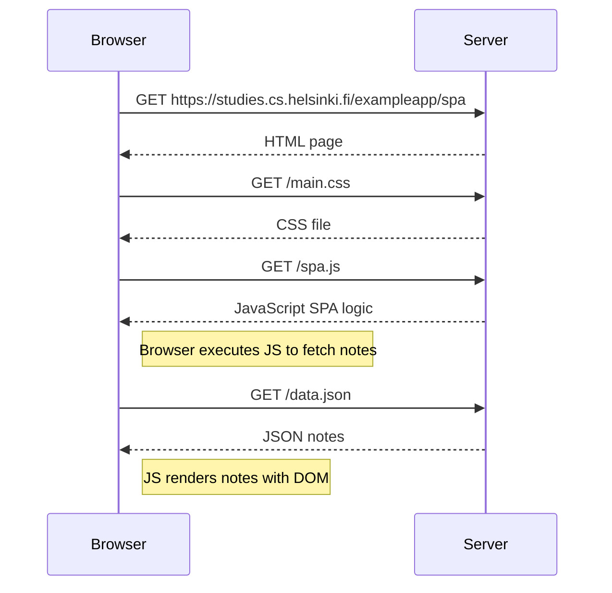

```mermaid
sequenceDiagram
    participant Browser
    participant Server

    Browser->>Server: GET https://studies.cs.helsinki.fi/exampleapp/spa
    Server-->>Browser: HTML page

    Browser->>Server: GET /main.css
    Server-->>Browser: CSS file

    Browser->>Server: GET /spa.js
    Server-->>Browser: JavaScript SPA logic

    Note right of Browser: Browser executes JS to fetch notes

    Browser->>Server: GET /data.json
    Server-->>Browser: JSON notes

    Note right of Browser: JS renders notes with DOM
``` 