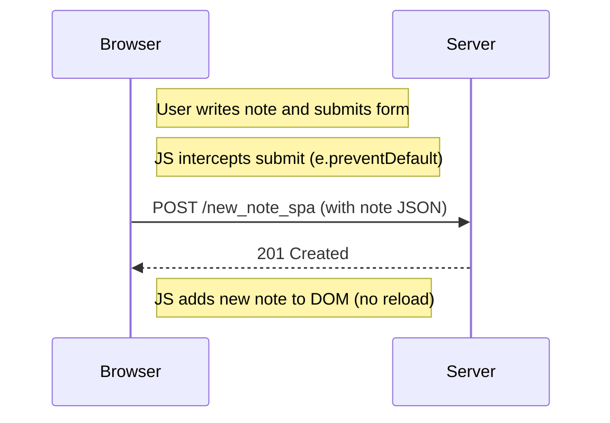

```mermaid
sequenceDiagram
    participant Browser
    participant Server

    Note right of Browser: User writes note and submits form

    Note right of Browser: JS intercepts submit (e.preventDefault)

    Browser->>Server: POST /new_note_spa (with note JSON)
    Server-->>Browser: 201 Created

    Note right of Browser: JS adds new note to DOM (no reload)
``` 